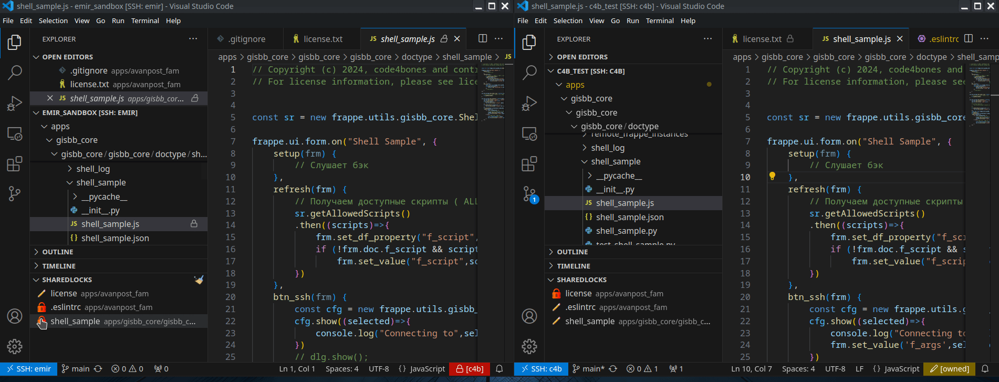

# SharedLock - File modification guard for team development

#### Used to acquire ownership of file(s) inside common project 

## Installation

    Install from vscode marketplace [SharedLock](https://marketplace.visualstudio.com/items?itemName=code4bones.sharedlock).

## Setup

    1. Open extension settings and setup common redis connection params
    2. Each team member need to set identical redis instance, and DB number

## Demos

    

